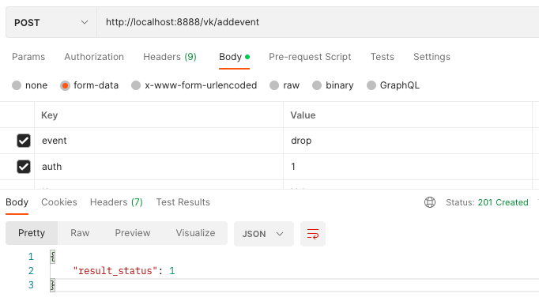
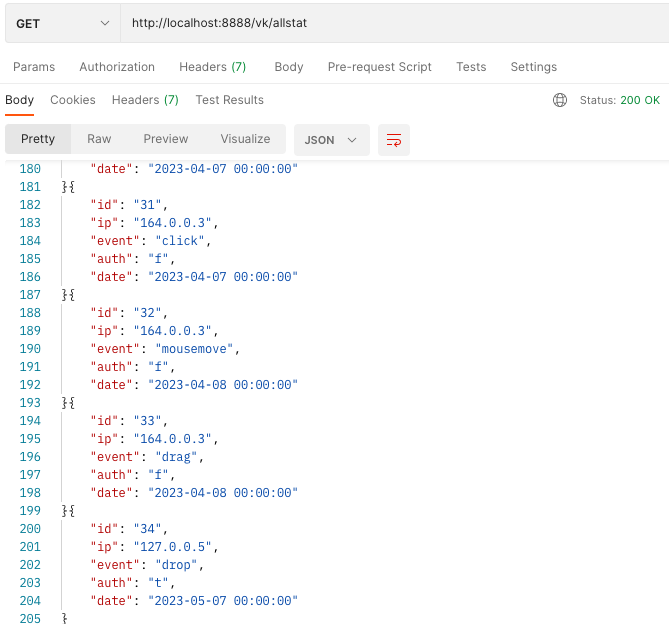
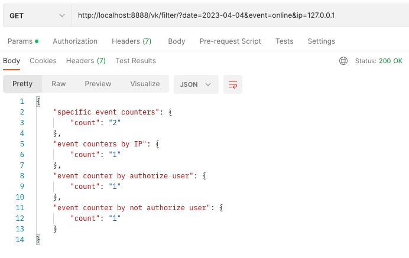
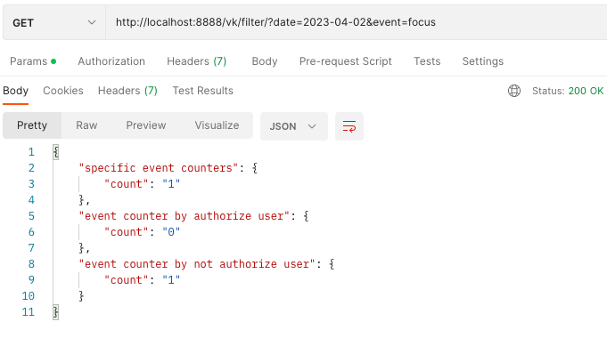
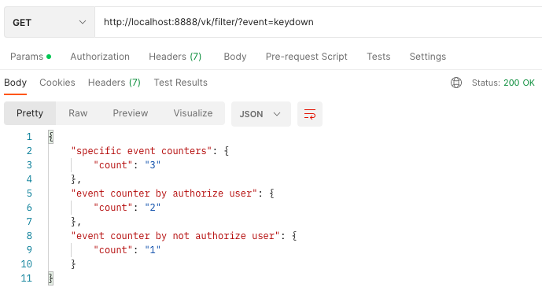
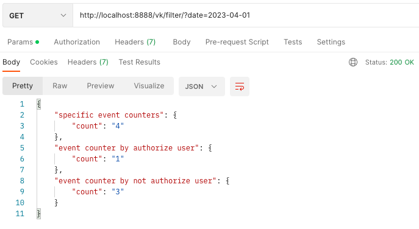

# Make a set of API methods for saving events and getting statistics.

The first method should take as input parameters the name of the event and the status of the user (authorized or not). The server must then add ancillary information and store the event. Use postgre as storage.

Add a note: /addevent

View all records from the database: /allstat

The second method should allow filtering.

Filter by date, event and ip: filter/?date=2023-04-04&event=online&ip=127.0.0.1

Filter by date, event: filter/?date=2023-04-02&event=focus

Filter by event: filter/?event=keydown

Filter by date: filter/?date=2023-04-01

